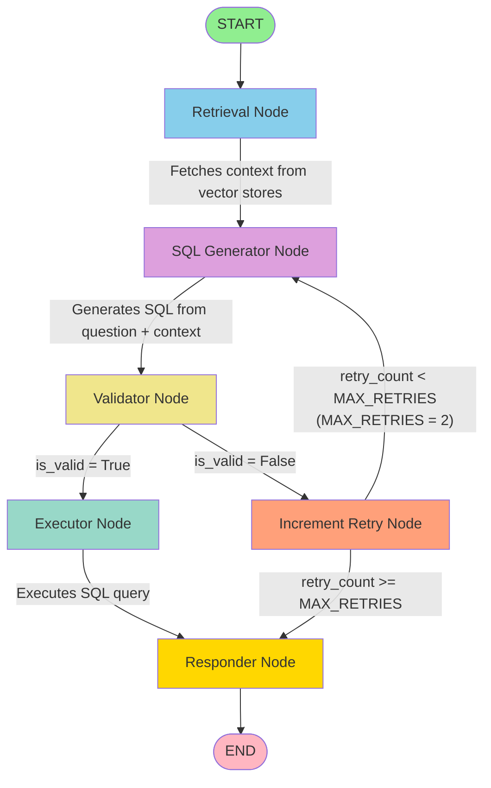

# LangGraph Agent Flow Diagram

This document visualizes the LangGraph agent structure for the text-to-SQL application.

## Graph Structure



## Node Descriptions

### 1. Retrieval Node
- **Purpose**: Fetches relevant context from ChromaDB vector stores
- **Searches**:
  - SQL pairs (few-shot examples) - top 5 results
  - Domain metadata (business rules, terms) - top 5 results
  - Database schema info - top 10 results
- **Output**: Populates `sql_pairs`, `metadata`, and `database_info` in state

### 2. SQL Generator Node
- **Purpose**: Generates SQL query from natural language question using Azure OpenAI
- **Input**: Question + retrieved context (SQL pairs, schema, metadata)
- **Process**:
  - Formats context into prompt
  - Includes system rules and conversation history
  - Calls Azure OpenAI LLM
  - Parses SQL from response (extracts from ```sql``` blocks)
- **Output**: `generated_sql` and `sql_explanation`

### 3. Validator Node
- **Purpose**: Validates generated SQL for syntax and safety
- **Checks**:
  - SQL syntax validation using sqlglot
  - Safety checks (no INSERT, UPDATE, DELETE, DROP, etc.)
  - Table existence verification (as warning)
- **Output**: `is_valid`, `validation_errors`, `validation_warnings`

### 4. Executor Node
- **Purpose**: Executes validated SQL query against PostgreSQL database
- **Conditions**: Only executes if `is_valid = True`
- **Process**:
  - Executes SQL with row limit (from settings)
  - Handles execution errors
- **Output**: `executed`, `results`, `row_count`, `columns`, `execution_error`

### 5. Increment Retry Node
- **Purpose**: Increments retry counter when validation fails
- **Output**: Increments `retry_count` in state

### 6. Responder Node
- **Purpose**: Generates natural language response from query results
- **Process**:
  - Formats query results and execution status
  - Calls Azure OpenAI LLM to generate natural language explanation
  - Supports streaming for SSE responses
- **Output**: `natural_language_response` and adds AIMessage to conversation

## Conditional Routing Logic

### After Validation (`should_execute`)
```python
if is_valid:
    → executor
else:
    → increment_retry
```

### After Retry Increment (`should_retry`)
```python
if not is_valid and retry_count < MAX_RETRIES:
    → sql_generator (retry)
else:
    → responder (give up)
```

## State Schema

The `AgentState` TypedDict contains:
- **Messages**: Conversation history (with memory reducer)
- **Question**: Current user question
- **Retrieved Context**: `sql_pairs`, `metadata`, `database_info`
- **Generated SQL**: `generated_sql`, `sql_explanation`
- **Validation**: `is_valid`, `validation_errors`, `validation_warnings`
- **Execution**: `executed`, `results`, `row_count`, `columns`, `execution_error`
- **Response**: `natural_language_response`
- **Session**: `session_id`
- **Retry Tracking**: `retry_count`

## Flow Summary

1. **Entry**: User question enters at `retrieval` node
2. **Context Retrieval**: Vector search for relevant examples and schema
3. **SQL Generation**: LLM generates SQL from question + context
4. **Validation**: SQL is validated for syntax and safety
5. **Execution** (if valid): SQL runs against PostgreSQL
6. **Retry Logic** (if invalid): Up to 2 retries with incremented counter
7. **Response**: Natural language explanation generated
8. **Exit**: Response returned to user

## Retry Mechanism

- Maximum retries: **2** (defined by `MAX_RETRIES`)
- When validation fails:
  1. Retry counter increments
  2. If under limit → retry SQL generation
  3. If limit reached → proceed to responder with error explanation

## Graph Code Reference

The graph is defined in `src/text_to_sql/agents/graph.py`:
- Entry point: `retrieval` node
- Nodes: `retrieval`, `sql_generator`, `validator`, `executor`, `increment_retry`, `responder`
- Conditional edges: `should_execute` (after validator), `should_retry` (after increment_retry)
- Checkpointer: Enabled for session persistence and conversation memory
